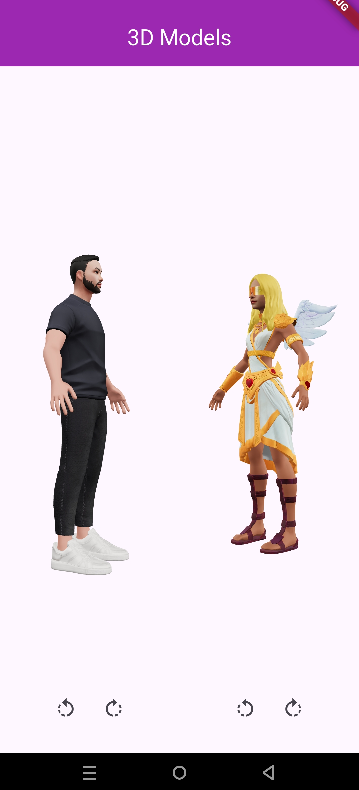

# attempt_3

This is HNG12 mobile task 3.
A project that uses flutter to display and animate 3d models. 


## Dependencies Used

- cupertino_icons: used for IOS style icons
- flutter_3d_controller: used to display and animate the 3d models

## 📸 ScreenShots

| Light                                                    |
|----------------------------------------------------------|
|             |


## Setup
- Clone the repository
  ```bash
  git clone https://github.com/LordOlumide/countries_app
  ```

- Install dependencies
  ```bash
  flutter pub get
  ```

- Run the app
  ```bash
  flutter run
  ```

## Contributing
We welcome contributions from anyone. To contribute to the project, please follow these steps:
- Fork the repository.
- Create a new branch for your feature or bugfix.
- Make your changes and commit them.
- Push your changes to your forked repository.
- Open a pull request against the main branch of this repository.

Please ensure that your code follows the project's coding standards and includes appropriate tests.
